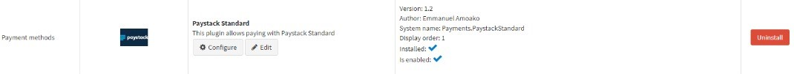
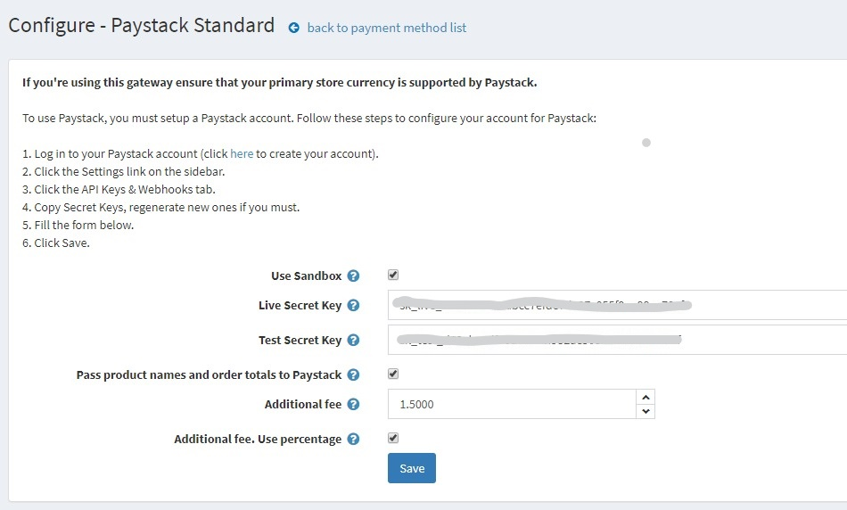

 

Paystack payment plugin for nopCommerce
================================================

The Paystack Standard payment plugin for nopCommerce is a payment method for the [nopCommerce] .Net open source shopping cart solution using [Paystack] to provide secure 
card payments.  The plugin uses card tokenization so your site never sees customer card details.  Full and partial refunds are also supported.

Installation
------------

**On a Visual Studio solution of NopCommerce**

1. Drag the Nop.Plugin.Payments.PaystackStandard folder to the src/Plugins

2. Go To Visual Studio and right-click on the Plugins folder in Solution Explorer

3. Hover over Add and click on Existing Project.

4. Find the PaystackStandard plugin project (.csproj) file in the 'Add Existing Project' window and click Open

5. Rebuild the solution

6. Click on the PaystackStandard plugin in the Plugins folder

7. Rebuild the PaystackStandard plugin from the build toolbar item

**On a compiled Visual Studio solution of NopCommerce**

1. Upload the plugin (Payments.PaystackStandard directory) to the /plugins folder in your nopCommerce directory.

2. Restart your application (or click Reload list of plugins button).

3. Scroll down through the list of plugins to find the newly installed plugin.

4. Click on the Install link to install the plugin.

Configuration
-------------

To configure the plugin click the `Configure` button for the Paystack Standard plugin on the Admin panel(go to `Configuration -> Plugins -> Local Plugins`).  This displays a
page allowing you to enter the API keys necessary to make payments using the plugin.

We allow sandbox keys for testing and live keys for real payments to be entered and you can select which key to use by using the `Use Sandbox` checkbox.

To use [Paystack]'s secure hosted payment form for your payments live, uncheck `Use Sandbox`.

Your API keys can be obtained by logging into the [Paystack] dashboard and copying the keys from `Settings`.

When done press the `Save` button to complete the configuration.

Again, no card details are ever sent to your site. You will be redirected back to the store once payment is submitted.

Development
-----------

The source code is located in the folder `Nop.Plugins.Payments.PaystackStandard`.   Copy this folder to the 
`Presentation\Nop.Web\Plugins` folder of the nopCommerce project.

Compatibility
-------------

This plugin is compatible with nopCommerce 4.2.

Version
-------

This is version 1.3

[nopCommerce]: http://www.nopcommerce.com
[Paystack]: https://www.paystack.com
